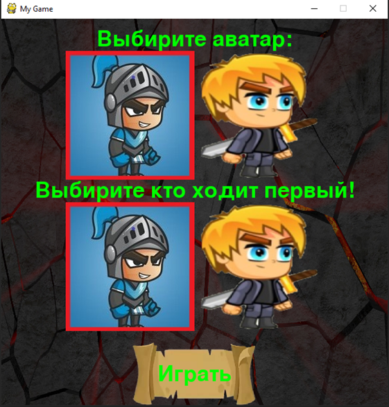

# Игра крестики нолики
___
Эта вторая программа написанная мною во время изучения основ языка Python. По мере знакомства с возможностью языка 
я модифицировал ее в соответствии с новыми навыками. Первая версия была написана как домашняя работа в консольном 
исполнении, далее появилась графика.

Первая версия была написана как домашняя работа. Написание, по сути пустяковой программы очень затянуло.
В дальнейшем по мере знакомства с языком ***Python*** начал улучшать программу и перевел ее в графику, 
для этого изучил библиотеку pygame. Но есть одно “но”, а именно процесс разработки требует много свободного
времени, а это несколько замедляет общие изучение языка, так что я отложил данный проект и планирую вернуться 
к нему чуть позже, тем более идей много. А пока посмотрите на те версии программы которые я успел написать за
первые 6 месяцев

Ниже приведены версии игры, для каждой игры написан Readme файл с описанием того как создавалась игра, 
как ее запускать:

 1. [Версия 1.0](XO%20ver1.0%20(console)/README.md) Консольная версия (2 месяца изучения языка)
 2. [Версия 2.0](XO%20ver%202.0%20(graphic)/README.md) Версия в графике с помощью модуля [Pygame](https://www.pygame.org/docs/) (5 месяцев изучения языка)

